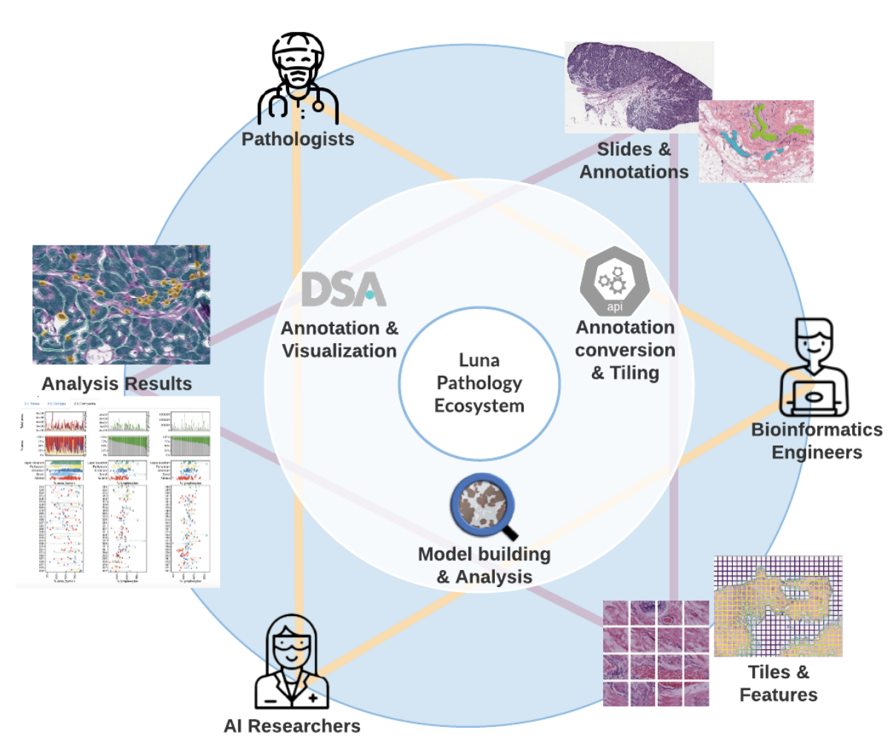

============
About Luna
============

Luna serves as the core computational library for multi-modality oncology data analysis.

Motivation and Purpose
======================

Research in Computational oncology requires collaboration between lots of people
with different specialities. The purpose of Luna is to make the interactions between
all of these different users as seamless and easy as possible.

.. _fig-luna_overview:

   Computational oncology research requires collaboration among pathologists, radiologists, 
   oncologists, bioinformatics engineers, and AI researchers. TODO: Change figure to go beyond
   just pathology 

Publications using Luna
=======================

The following publications either use Luna or were supported by the MSK MIND Team

**2022**

Boehm, K.M., Aherne, E.A., Ellenson, L. et al. Multimodal data integration using machine
learning improves risk stratification of high-grade serous ovarian cancer. Nat Cancer 3,
723–733 (2022). https://doi.org/10.1038/s43018-022-00388-9a

Vanguri, R.S., Luo, J., Aukerman, A.T. et al. Multimodal integration of radiology, pathology and genomics for prediction of response to PD-(L)1 blockade in patients with non-small cell lung cancer. Nat Cancer 3, 1151–1164 (2022). https://doi.org/10.1038/s43018-022-00416-8

Authors
=======

MSK MIND Team 
