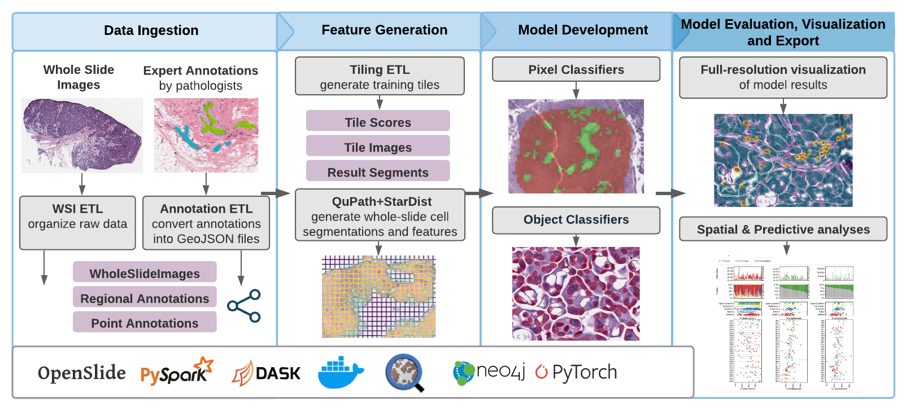

# Basic Command Line Use

After installation, the basic pattern for luna CLI tools looks like
this:

    cli_call -a app_config.yaml -s id -m method_config.yaml

`app_config.yaml` is a file that specifies how the backend is
configured. It'll include parameters related to Spark and settings
related to the object store. The `id` refers to the input object. This
will vary depending on the CLI, but is often the filename or unique
identifier of something like a slide. `method_config.yaml` are the
parameters that are passed to the underlying python function call.

To see examples of various CLI calls, take a look at some of the various
[Tutorials](tutorials.md) for our pathology workflows.

# API Use

In addition to launching jobs from the command lines, Luna can also be
used in Python files or Jupyter Notebooks. After installation, you can
simply import it into a Python file and access the built-in functions
just as you would for any other library :

    import luna
    from luna.pathology.common import preprocess

# Pathology Workflow

At a high level, the pathology workflow that Luna supports resembles

*The pathology workflow offers CLI utilities to take raw WSIs through
the process of feature generation, model training and inference and
 visualization.*

## Data Ingestion

The process starts with Whole Slide Images (WSIs) and annotations from
expert pathologists. WSIs are stored on disk with their cooresponding
file paths and associated metadata are organized in
[Parquet](https://databricks.com/glossary/what-is-parquet) tables. The
format of the annotations can vary depending on the application the
pathologists use to annotate the slide in, for example Digital Slide
Archive (DSA) exports annotations as JSON objects. Internally, we
convert and store these annotations as GeoJSON objects. Our GeoJSON
format supports both point annotations, for objects like cells and
lymphocytes, as well as regional annotation for when the pathologist
annotates a large region of tissue.

## Feature Generation and Model Development

We use the Tiling ETL to generate sequential tiles of arbitrary size
from WSIs, at a specified magnification. At this point, tiles can also
be filtered to remove extraneous or non-informative tiles, such as tiles
within glass areas. Additionally, the Tiling ETL can be combined with
available annotations, allowing users to generate exclusively labled
tiles for use in building datasets for machine learning models. The
tissue classifier package is simply a wrapper around a PyTorch training
loop and can be easily changed to experiment with and develop custom
models.

The point annotations can be also be extracted and used to build models.
Luna supports whole-slide cellular segmentation via QuPath through
StarDist, a deep-learning based segmentation library. We've dockerized
QuPath and StarDist together to allow for independent and headless
processing of individual slides, which in practice, allow us to support
processing parallelization across larger cohorts of slides.

## Visualization and Statistical Analysis

Finally, as a final endpoint for visualizing models and slides, we have
coupled DSA into our platform to provide a web interface for quality
controlling slides and interactive evaluation of built model
performance. In order to support the varying types of models that may
arise during computational pathology workflows, we have built several
CLIs to allow for robust model visualization through DSA for both
tissue-level models and cellular models.

We also offer statistical analysis modules to take features derived from
infered tissue types and cells to predict clinical endpoints

## Qupath and Stardist

Since some of the processes in Luna Pathology can interface with output from
[Qupath](https://qupath.github.io/), a digital image analysis platform that can
be quite useful when it comes to analyzing pathology images. Qupath runs using
Groovy-based scripts, which can be run through the UI, or in this case,
headless through a docker container.

Qupath can also be used to run
[Stardist](https://github.com/stardist/stardist), a sophisticated algorthim for
nuclear segmentation and classification. It runs using a tensorflow backend,
and has some prebuilt models available to perform cellular segmentation in H&E
and IF images. When running Stardist in Qupath, nuclear/cellular objects will
be created as well as a dictionary of per-cell features such as staining
properties (hematoxylin and eosin staining metrics for H&E), and geometric
properties (size, shape, lengths, etc). The results of the cellular
segmentation can be used as inputs to e.g. the spatial statistics modules.

We provide a a way to use Qupath (and Stardist) in a headless, dockerized form
in the [repository](https://github.com/msk-mind/docker/tree/master/qupath). The
container in this repository includes (Cuda-based) GPU support and additional
convience scripts. See the Readme for more information about use.

# Troubleshooting

Here are some troubleshooting instructions and fixes to common issues.
